- Looks like i like
	- defined subject colors withs trong colors pop, over void backgrounds.
	- "Liquid "flow motions in the objects and their composition.
	- And glassy  glossy textures like frosted glass and ribbed.
	- Spunds like am2 ps2 and ps1 and slav house.
- ## Illustrations
- row #v.kanban
	- 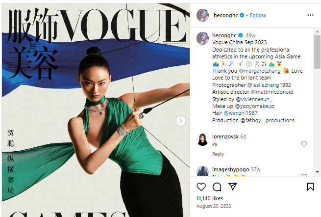{:height 263, :width 344}
	- 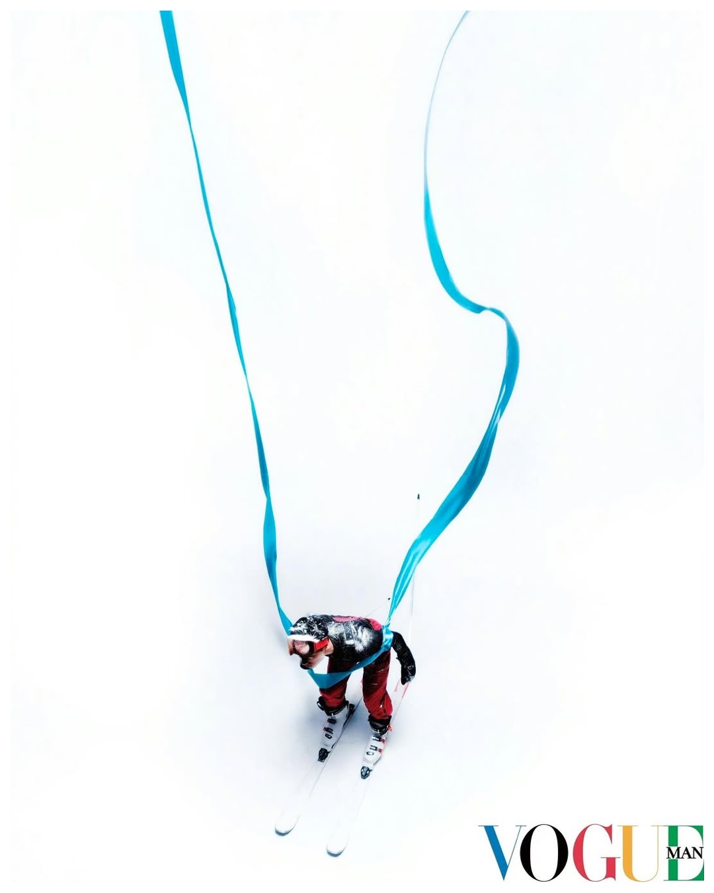{:height 308, :width 208}
	- 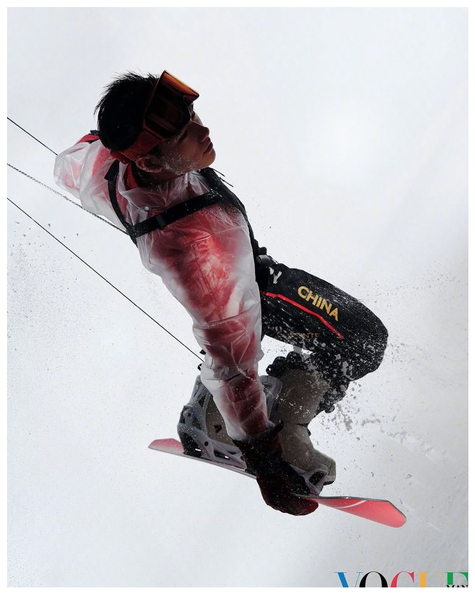{:height 618, :width 257}
	- 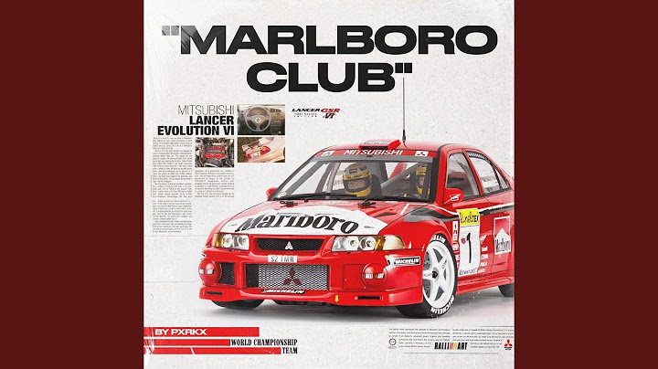{:height 140, :width 331}
	- 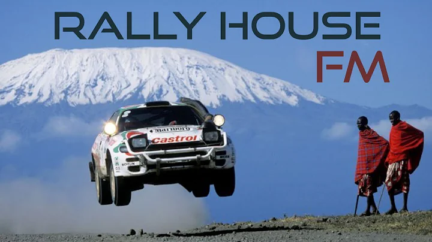{:height 242, :width 319}
	- {:height 173, :width 325}
- 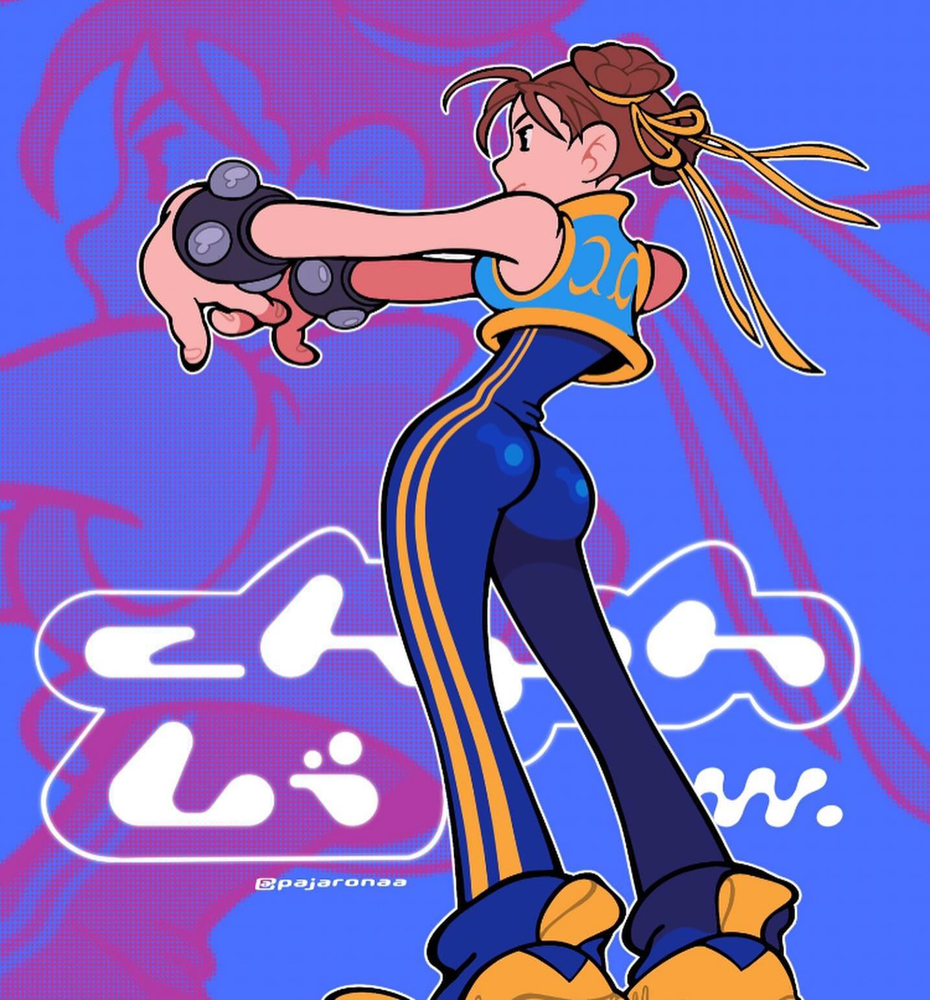{:height 223, :width 213}
-
- ## Textures
- row #v.kanban
	- 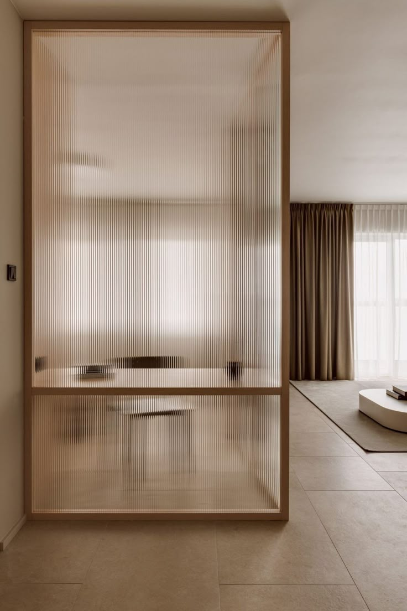{:height 646, :width 246}
	  id:: 69997719-8b73-4082-871c-43c19fcca530
	- 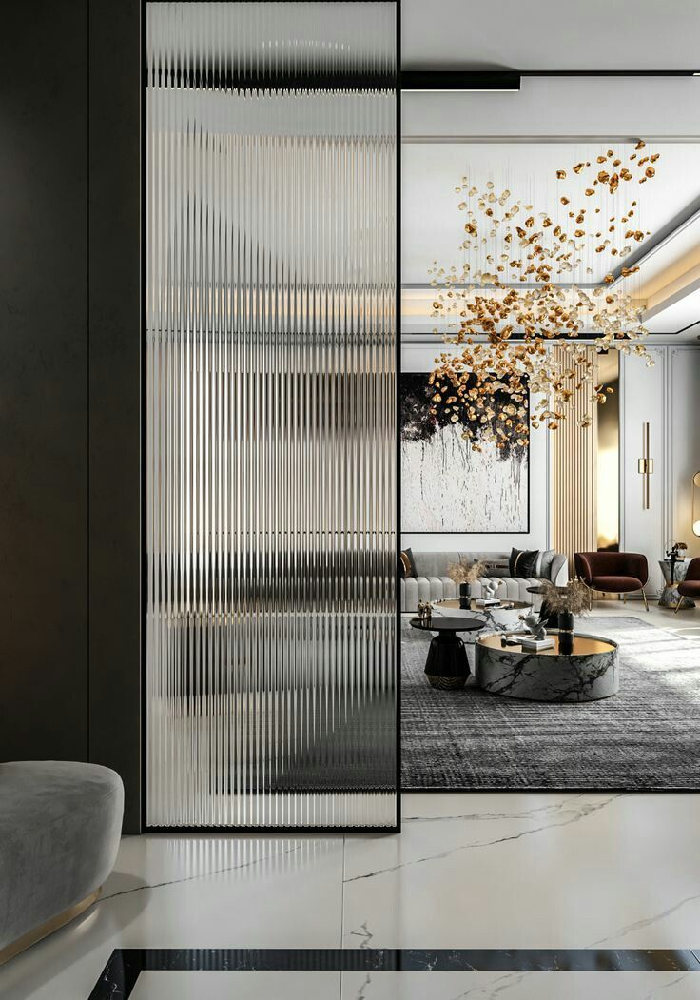{:height 410, :width 242}
	- 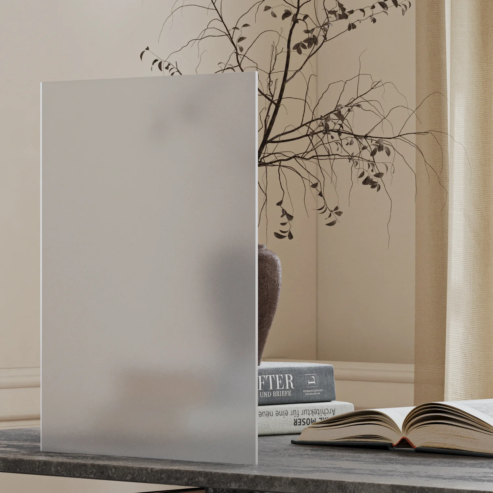{:height 240, :width 256}
	- 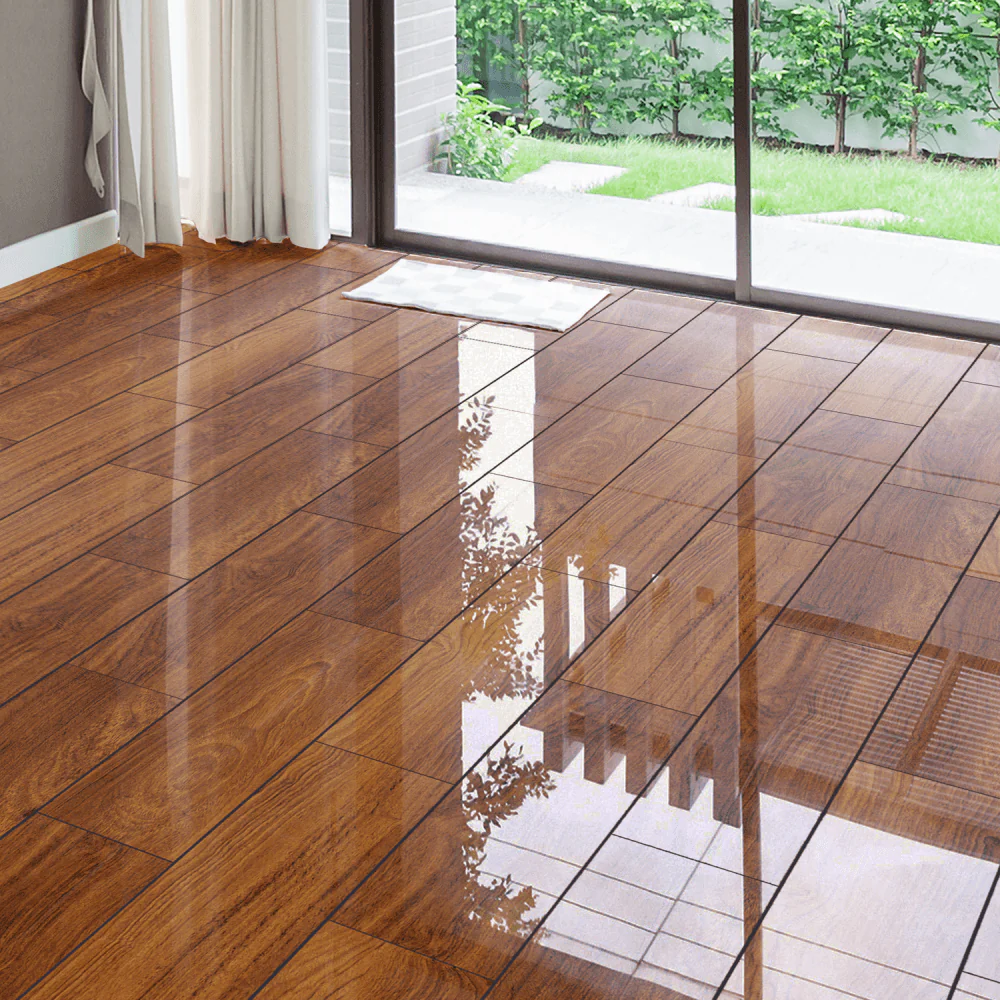{:height 442, :width 264}
	-
- ## Apartments
- row #v.kanban
	- 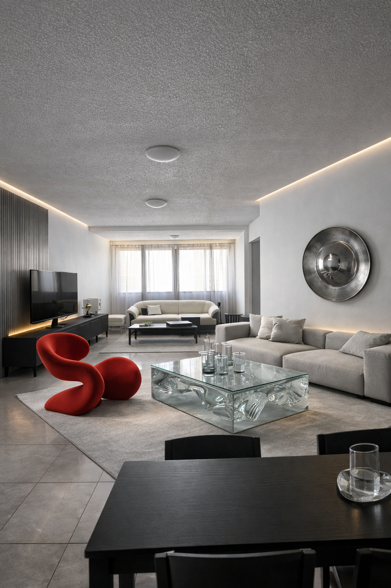{:height 166, :width 134}
	- 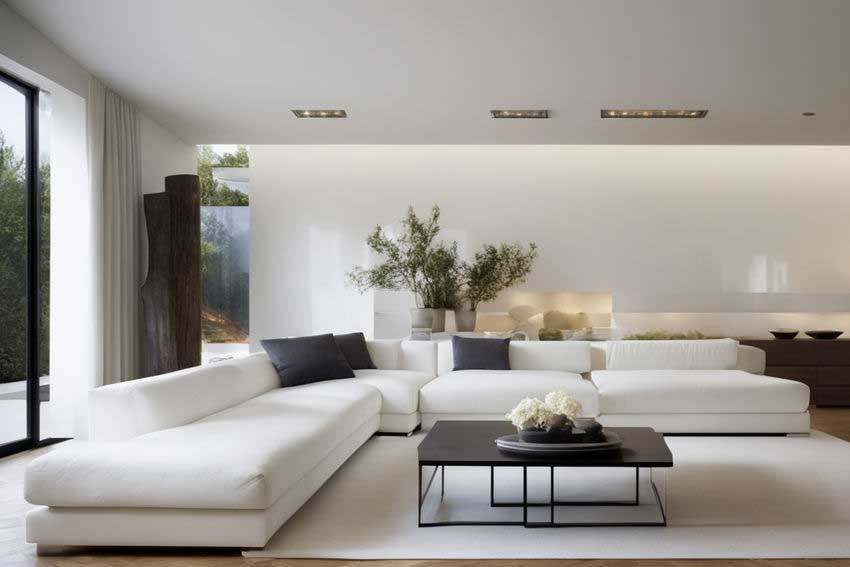{:height 292, :width 313}
	- 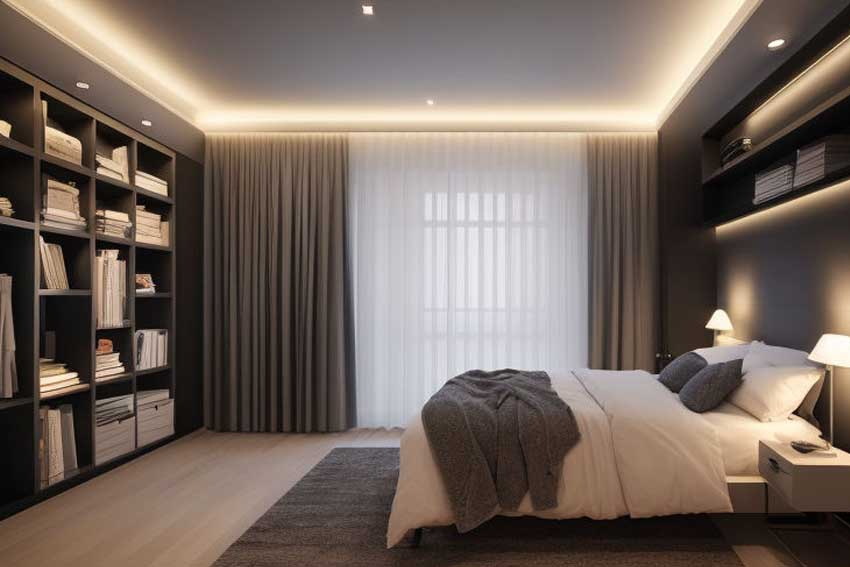{:height 317, :width 333}
	- 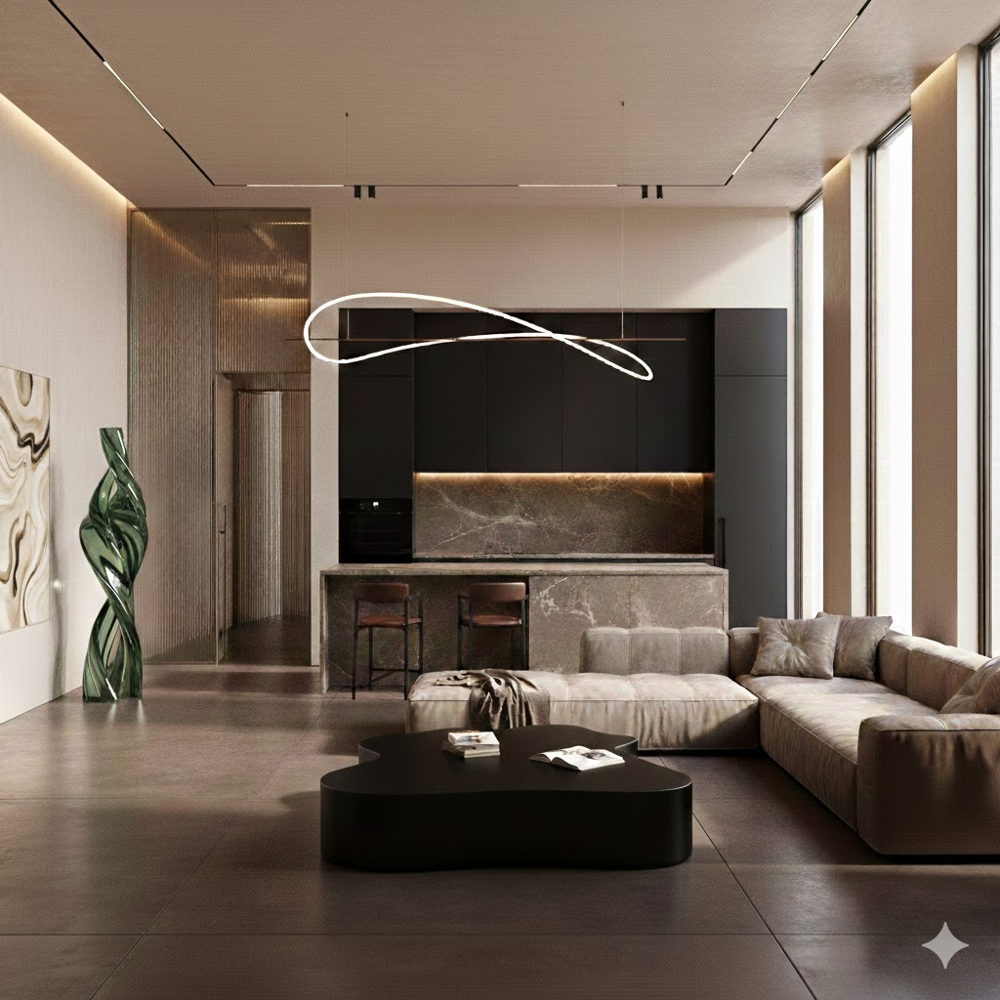
	-