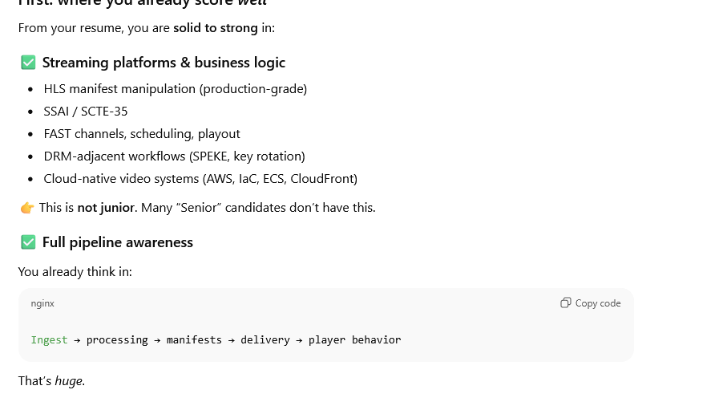

- {{renderer :kanban_651a3832-a06f-4dee-8c77-bc15908765e8}}
- ## Work Items
	- Pending
		- {{query (and [[work-item]] (task TODO LATER) (not (page Templates)))}}
		  query-table:: false
		-
	- Working
	  collapsed:: true
		- [[prueba work item]]
		  #defenses
		- {{query (and [[work-item]] (task NOW DOING "IN-PROGRESS"))}}
		  collapsed:: true
	- Done
	  collapsed:: true
		- {{query (and [[work-item]] (task DONE))}}
		  collapsed:: true
-
-
-
-
- # Items Backlog
	- /it
	- ## TODO [[WKI-Media Engineer path]] 
	  #work-item
		- **Notes**:
		  collapsed:: true
			- Define los succesfull etc
			- ### 🔧 Media correctness & debugging services (very viable)
			  
			  **What companies pay for:**
			- Playback breaks on some devices
			- Ads fail to splice correctly
			- LL-HLS latency spikes
			- CMAF segments misaligned
			- DRM weirdness
			- Encoder → packager mismatch
			  
			  **Your service:**
			  
			  > 
			  
			  “We diagnose and fix streaming playback issues in production.”
			  
			  Deliverables:
			- Packet captures
			- Manifest audits
			- fMP4 analysis
			- Concrete fixes
			  
			  Clients:
			- OTT platforms
			- FAST channel operators
			- Sports startups
			- Ad-tech companies
			  
			  This is **high-margin consulting**.
			- But senior roles are **not about *new* tools**.
			  
			  They’re about **deeper layers of the *same* tools**.
			  
			  You already *use*:
			- HLS
			- FFmpeg
			- SSAI
			- Cloud pipelines
			- Live/VOD stitching
			- What the job posting hints at is:
			  
			  > “Do you understand what happens **inside** these tools when things go wrong?”
			  
			  That’s a depth shift, not a direction change.
			- ### 2. You separated things that are actually one system
			  
			  Before:
			- HLS felt separate from codecs
			- Manifests felt separate from players
			- Cloud pipelines felt separate from media internals
			  
			  Now you’re seeing:
			  
			  ```
			  Encoder → timestamps → fMP4 → CMAF → manifest → player → ad logic → user experience
			  ```
			  
			  It’s **one continuous system**.
			  
			  The job posting wasn’t asking for “new stuff” — it was asking for:
			  
			  > 
			  
			  Someone who sees *all of this* as a single mental model.
			  
			  ---
			- ### 3. You underestimated how  *natural*  your path already is
			  
			  This is the big one.
			  
			  You thought:
			  
			  > 
			  
			  “This role is for *other* people who learned codecs somehow.”
			  
			  Reality:
			- You already work in **streaming**
			- You already touch **live systems**
			- You already manipulate **manifests**
			- You already deal with **timing, alignment, SSAI, and delivery constraints**
			  
			  That role is not a different mountain.
			  
			  It’s **the same mountain, higher up**.
			  
			  You just hadn’t named the next slope.
			- ## Now let’s answer your actual question
			- ### _“What things should I learn to be a better Streaming Media Engineer?”_
			- I’ll rank your options **by ROI**, not by buzzwords.
			- ---
			- ## 🔥 #1 Highest ROI: CMAF + HLS/DASH _at painful depth_
			- You already suspected this — you’re right.
			- You should **double down here first**.
			- Not “I know HLS”, but:
			- ### What to learn _specifically_
				- fMP4 box structure (`moov`, `moof`, `mdat`, `traf`, `tfdt`, `trun`)
				- Segment alignment across audio/video
				- Why misaligned segments break SSAI & players
				- Partial segments (LL-HLS)
				- EXT-X-PART, EXT-X-SERVER-CONTROL
				- Why Apple players behave differently than Android/TVs
				- Manifest edge cases:
					- discontinuities
					- timeline jumps
					- ad splice boundaries
					- clock drift
			- ### What this gives you
				- You stop being “the manifest person”
				- You become “the person who understands **why playback breaks**”
			- 👉 This is **Senior Streaming Engineer energy**.
			- ---
			- ## 🔥 #2 Encoders → packagers → players (end-to-end _media_ focus)
			- You already understand the _system_.
			- Now you need to understand the **media flow inside it**.
			- ### Focus areas
				- FFmpeg beyond CLI flags:
					- demux → decode → filter → encode → mux
				- Encoding ladders & ABR tradeoffs
				- GOP structure and keyframe placement
				- Latency vs quality decisions
				- Audio/video sync under stress
			- You don’t need to write a codec — but you _must_ understand encoder behavior.
			- ---
			- ## ⚠️ #3 RTMP / SRT / WebRTC (useful, but secondary)
			- This is important **only if you want to lean live-first**.
			- Learn:
				- RTMP ingest pain points
				- SRT vs RTMP tradeoffs
				- WebRTC _conceptually_ (don’t go full signaling server unless needed)
			- Good knowledge — **not your top gap**.
			- ---
			- ## ⚠️ #4 C/C++ encoder code & FFmpeg internals (optional, not mandatory)
			- Let me be blunt:
			- > You do **not** need to become a C++ codec engineer to level up meaningfully.
			- However, **reading** FFmpeg code and:
				- Understanding how filters are chained
				- Knowing where timestamps are calculated
				- Knowing where sync can break
			- …is very valuable.
			- **Writing production C++ encoder code is optional** unless you want to specialize deeply.
			- ---
			- ## What I’d recommend _for you specifically_ (12–18 month focus)
			- Based on your background:
			- ### Phase 1 (3–6 months)
				- CMAF + LL-HLS deep dive
				- fMP4 atom inspection
				- Player debugging (Apple vs Android vs TV)
				- Packet capture + media inspection workflows
			- ### Phase 2 (6–12 months)
				- Build a **live CMAF pipeline** yourself
				- Introduce failure modes:
					- clock drift
					- dropped segments
					- encoder restarts
				- Measure latency, sync, recovery
			- ### Phase 3 (optional specialization)
				- FFmpeg internals
				- Hardware encoders
				- Cost vs quality optimization
			- ---
			- ## One important mindset correction (this matters)
			- You are not “not that profile”.
			- You are:
			- > **A streaming platform engineer evolving toward a media-core engineer.**
			- That’s a _very_ good trajectory.
			- If you lean into **media internals + playback pain**, your resume will start matching postings like that naturally — without pretending.
			- ---
			- ## Final straight answer to your question
			- If you must choose **one thing** to focus on:
			- > **CMAF + HLS/DASH at painful, player-breaking detail**
			- That is the highest leverage move for _you_.
			- If you want, next I can:
				- Design a **learning roadmap using projects you already did**
				- Help you **reframe your resume** to signal deeper media expertise
				- Or simulate **interview questions** for senior streaming roles
			- Just tell me what you want next.
		- **Succes looks like**
			- **Why**:
		- **Disciplines:**
		- **More:**
		  collapsed:: true
			- **Priority:**
			- **Time Est (hrs):**
			- **Cognitive Load:**
			- **Success:**
			- **Sprint:**
	- ## TODO [[WKP-Now Contract]]
	  #work-item #work-pack
		- **Intent**:
		  collapsed:: true
			- **Notes:**
			- **Why**:
		- **Succes looks like:**
		- **Priority:**
		- **Disciplines:**
	- ## TODO [[WKI-CV Fix]] 
	  WorkPack:: [[WKP-Now Contract]] 
	  #work-item
		- **Succes looks like**
		  collapsed:: true
			- **Why**:
		- **Disciplines:**
		- **Notes**:
		- **More:**
		  collapsed:: true
			- **Priority:**
			- **Time Est (hrs):**
			- **Cognitive Load:**
			- **Success:**
			- **Sprint:**
	- ## TODO [[WKI-Streaming Engineer review]] 
	  WorkPack:: [[WKP-Now Contract]] 
	  #work-item
		- **Succes looks like**
		  collapsed:: true
			- **Why**:
		- **Disciplines:**
		- **Notes**:
		- **More:**
		  collapsed:: true
			- **Priority:**
			- **Time Est (hrs):**
			- **Cognitive Load:**
			- **Success:**
			- **Sprint:**
	- ## TODO [[WKI-Ottera Recap]] 
	  WorkPack:: [[WKP-Now Contract]] 
	  #work-item
		- **Succes looks like**
		  collapsed:: true
			- **Why**:
		- **Disciplines:**
		- **Notes**:
			- Take out the best tehcnical profesisnoal desciption of the things done so I can say expirience with this that that etc
			- 
			- "Your resume is **platform & product-heavy**, not **media-core-heavy**."
			-
		- **More:**
		  collapsed:: true
			- **Priority:**
			- **Time Est (hrs):**
			- **Cognitive Load:**
			- **Success:**
			- **Sprint:**
	- ## TODO [[WKI-Data streaming Learn]] 
	  WorkPack:: [[WKP-Now Contract]] 
	  #work-item
		- **Succes looks like**
		  collapsed:: true
			- **Why**:
		- **Disciplines:**
		- **Notes**:
		- **More:**
		  collapsed:: true
			- **Priority:**
			- **Time Est (hrs):**
			- **Cognitive Load:**
			- **Success:**
			- **Sprint:**
	- ## TODO [[WKI-Back End review]] 
	  workpack:: [[WKP-Now Contract]]
	  id:: 698a3c93-ebcd-42ff-a434-e7d183e09407
	  #work-item
		- **Succes looks like**
		  collapsed:: true
			- **Why**:
		- **Disciplines:**
		- **Notes**:
		- **More:**
		  collapsed:: true
			- **Priority:**
			- **Time Est (hrs):**
			- **Cognitive Load:**
			- **Success:**
			- **Sprint:**
	- ## TODO [[WKI-Front end review]]
	  WorkPack:: [[WKP-Now Contract]] 
	  #work-item
		- **Succes looks like**
		  collapsed:: true
			- **Why**:
		- **Disciplines:**
		- **Notes**:
		- **More:**
		  collapsed:: true
			- **Priority:**
			- **Time Est (hrs):**
			- **Cognitive Load:**
			- **Success:**
			- **Sprint:**
-
- ## Random Topics 
  #random
	- TODO What companies and why are FPGA a thing? Also lets analize this job positng about it etc #IT
	-
-
-
-
-
-
-
-
- ## All todo please clean
  collapsed:: true
	- TODO
	  :LOGBOOK:
	  CLOCK: [2026-02-06 Fri 00:24:49]
	  :END:
		- {{query (task NOW LATER TODO DOING "IN-PROGRESS" WAIT WAITING)}}
		  collapsed:: true
	- :LOGBOOK:
	  CLOCK: [2026-02-06 Fri 00:25:25]
	  :END: